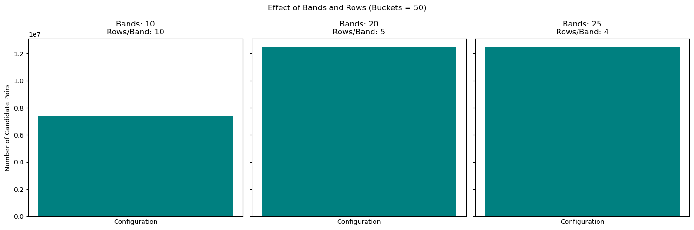

#  Finding frequent item-sets + LSH for similar papers.
Some of tasks done in this Repo([papers' dataset](https://drive.google.com/file/d/1-EhpZaY5gvbgNuEU5IskmlQ0EnNAG5cu/view?usp=drive_link)) which is part of a MDA assignment:
- Find the most frequent three-word sets using the priori-A algorithm
```markdown
('galaxies', 'mass', 'type'): 1118
('low', 'mass', 'stars'): 870
('galaxies', 'mass', 'star'): 852
('emission', 'energy', 'ray'): 770
('mass', 'star', 'stars'): 766
...
```
- Using the PCY algorithm, find the most frequent three-word sets.
```markdown
('early', 'galaxies', 'type'): 2131
('formation', 'galaxies', 'star'): 1722
('omega', 'pi', 'rho'): 1580
('eta', 'gamma', 'pi'): 1370
('cluster', 'clusters', 'mass'): 1350
```
- Implement code with the help of the LSH algorithm to find similar articles based on their text. 
- Implement the algorithm in such a way that in the input, the ID of an article is given and all the articles similar to it are displayed.
<p align="center">
    
</p>
